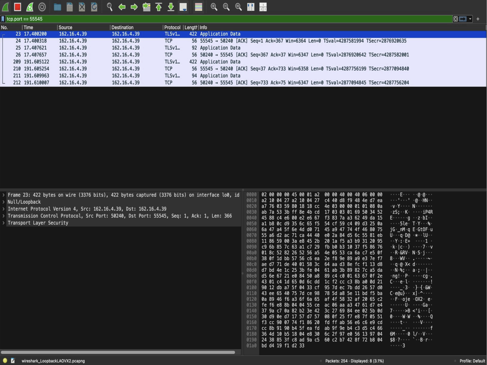

# Zer0Trace: A Secure Ephemeral Chat Application

**Zer0Trace** is a zero-trust, privacy-first encrypted messaging system built in Python. It features a GUI-based client with strong end-to-end encryption (SSL/TLS + RSA), real-time messaging, file sharing, and advanced privacy tools like self-destruct and kill switch — all without storing any data on the server.

---

## Key Features

- **End-to-End Encryption**  
  Messages are encrypted on the client side using RSA and transmitted over SSL/TLS.

- **Graphical User Interface (GUI)**  
  Built using Tkinter for a simple, user-friendly messaging experience.

- **Multi-User Real-Time Chat**  
  Multiple clients can join and securely communicate with each other.

- **Invisible Input Mode**  
  Hide your keystrokes with `*` to prevent shoulder surfing while typing sensitive messages.

- **Self-Destruct Timer**  
  Automatically wipes the chat interface after a timer expires, ensuring no residual data.

- **Global Kill Switch**  
  Immediately shuts down the server and connected clients — purging all in-memory messages and closing windows.

- **Exportable Chat Logs (Local Only)**  
  Users can save their own chat history locally; no logs are stored or shared by the server.

- **Zero Server Logging**  
  The server keeps no record of chat messages — once broadcast, messages are forgotten.

---

## Core Technologies Used

- **Python** – Language used for both server and client implementation
- **cryptography** – For RSA key pair handling and secure encryption/decryption
- **socket & ssl** – For TLS-wrapped encrypted communication channels
- **threading** – Enables real-time chat handling for multiple clients
- **dotenv** – Loads environment variables like cert paths securely
- **tkinter** – GUI framework used to build the client interface
- **colorama** – Adds colour-coded terminal feedback (for CLI messages)

---

## How It Works

- **Client-Side**
  - Loads the server’s **RSA public key** and SSL certificate
  - Encrypts all outgoing messages using RSA
  - Sends messages through a secure **TLS/SSL socket**

- **Server-Side**
  - Accepts multiple incoming SSL connections
  - Decrypts messages using its **RSA private key**
  - Broadcasts decrypted messages to all connected clients **without saving anything**

- **Privacy Philosophy**
  - Server maintains **zero logs**
  - Clients may export their **own logs** locally if they choose
  - No message is retained on disk — **only encrypted memory exchange**
 
---
## Wireshark Validation (Proof of Encryption)

Below is a screenshot of Zer0Trace traffic captured using Wireshark.  
It confirms that all communication is securely encrypted over **TLSv1.2**,  
with **no human-readable data** visible even when inspected directly:



> Packets captured on TCP port `55545` show encrypted application data,
> validating that **end-to-end security is enforced** during transmission.

## Usage

Once you've set up your certificates and environment variables, follow the steps below to use Zer0Trace securely.

---

### Start the Server

In your terminal:

```bash
python3 server.py
python3 client_gui_final.py
```
When prompted:
- Enter your nickname
- Enter the server IP address
- Once connected, you can start chatting securely in real-time with other users.
---

## Final Notes

Zer0Trace isn't just a chat room — it's a commitment to **true digital privacy**.  
By using **end-to-end encryption**, **zero logging**, and a privacy-first philosophy, this project proves that secure communication doesn't need to be complex — it needs to be **intentional**.

Whether you're building for ethical hackers, secure teams, or whistleblower platforms — Zer0Trace is the foundation.

---

>  _"In a world full of surveillance, staying silent isn't safe — staying secure is."_  

Built with purpose. Designed for privacy. Trusted by no one — by design.

